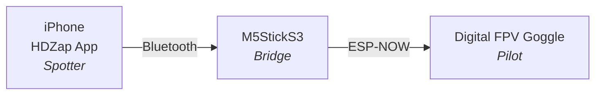
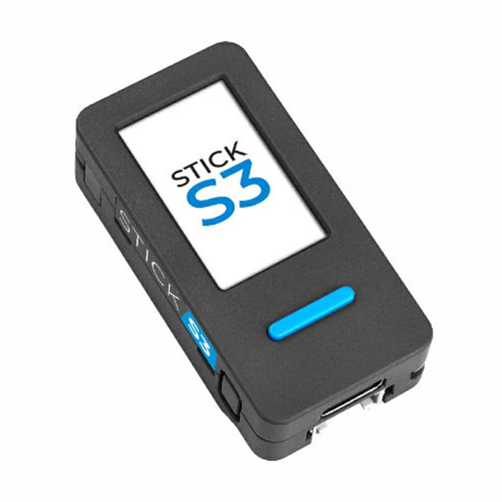
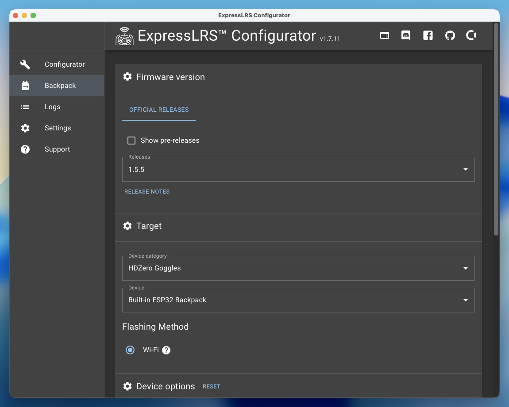
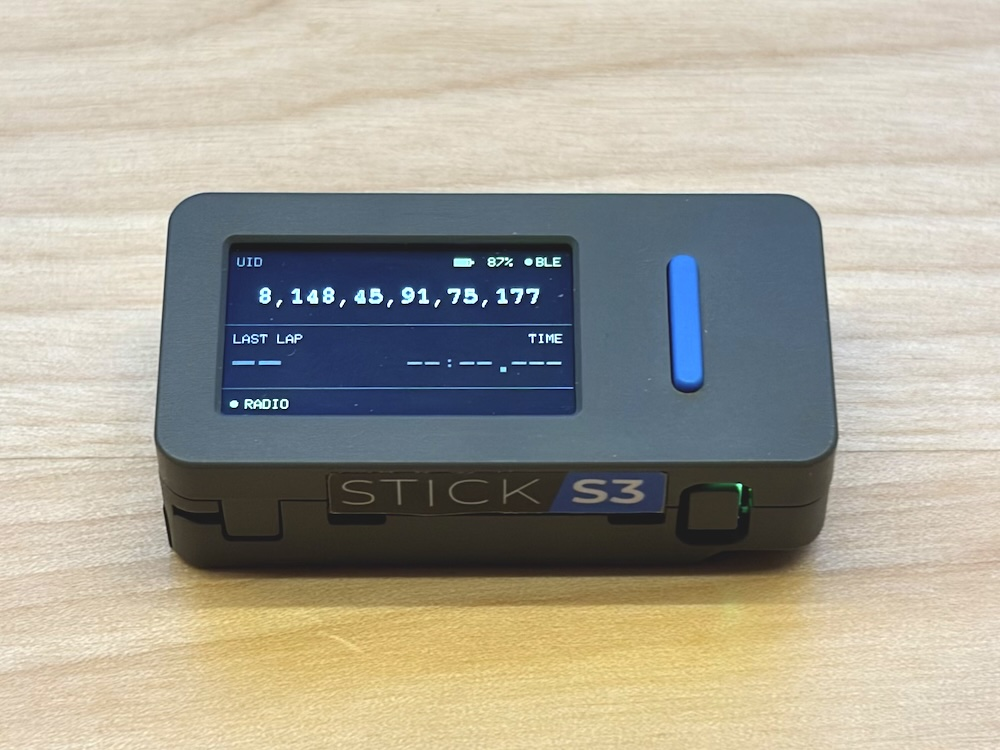
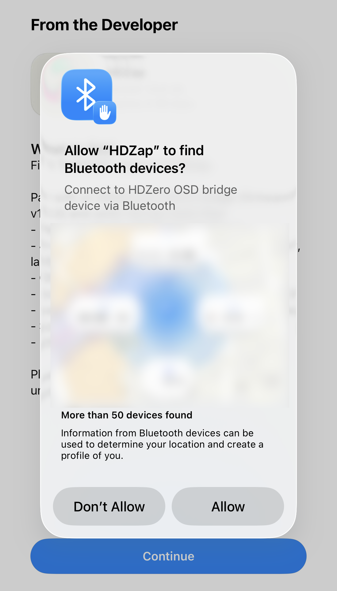
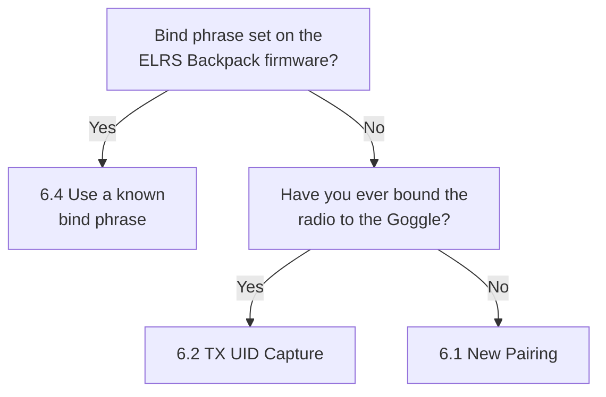

# HDZap User Manual

<p align="center">
  
</p>

<p align="center">
  <strong>English</strong> ・ <a href="https://saqoosha.github.io/HDZap/ja/">日本語</a>
</p>

> **Need help?** Email [a@saqoo.sh](mailto:a@saqoo.sh) or open an issue on [GitHub Issues](https://github.com/Saqoosha/HDZap/issues). Common problems are covered in [§11 Troubleshooting](#11-troubleshooting) below.

---

## Table of Contents

1. [What is this?](#1-what-is-this)
2. [What you'll need](#2-what-youll-need)
3. [Flashing firmware to the M5StickS3](#3-flashing-firmware-to-the-m5sticks3)
4. [Installing the iPhone app](#4-installing-the-iphone-app)
5. [Pairing the M5StickS3 with the iPhone (Bluetooth)](#5-pairing-the-m5sticks3-with-the-iphone-bluetooth)
6. [Binding to the Digital FPV Goggle](#6-binding-to-the-digital-fpv-goggle)
7. [Flight battery telemetry](#7-flight-battery-telemetry)
8. [Running a race](#8-running-a-race)
9. [After the race](#9-after-the-race)
10. [Settings reference](#10-settings-reference)
11. [Troubleshooting](#11-troubleshooting)
12. [Appendix](#12-appendix)

---

## 1. What is this?

<p align="center">
  <iframe width="640" height="480"
          src="https://www.youtube.com/embed/FXDKoBYkyB4"
          title="HDZap demo"
          frameborder="0"
          allow="accelerometer; autoplay; clipboard-write; encrypted-media; gyroscope; picture-in-picture"
          allowfullscreen></iframe>
</p>

HDZap is a system that **shows lap times measured on an iPhone on the OSD of a Digital FPV Goggle**. It assumes a **two-person setup**: a pilot and a separate spotter who runs the timer.



The system has three components:

- **iPhone app**: the timer UI the spotter operates — Start / Lap / Stop / history.
- **M5StickS3**: a palm-sized ESP32 device that acts as a bridge. It receives commands from the iPhone over Bluetooth and forwards OSD commands to the Goggle over a separate radio (ESP-NOW).
- **Digital FPV Goggle**: the FPV goggle the pilot wears. Its built-in ELRS Backpack receives OSD commands and overlays the lap times on the video.

> 💡 **The iPhone app works standalone too.** Lap timing, lap history, and voice announcements all work in-app without any extra hardware. Adding the M5StickS3 and Goggle just makes the lap times also appear on the Goggle's OSD.

### Glossary at a glance

These terms come up throughout the manual. Full definitions are in the [Appendix](#12-appendix).

| Term | One-line description |
|---|---|
| **Goggle** | FPV goggle the pilot wears. Supports Digital FPV Goggle / Digital FPV Goggle 2 |
| **ELRS Backpack** | ESP32 module built into the Goggle. Receives OSD commands |
| **UID** | 6-byte identifier. The Goggle and the M5StickS3 must share the same UID to communicate |
| **bind phrase** | A string that derives the UID. The same phrase always produces the same UID on any device |
| **OSD** | On-Screen Display. Text overlaid on the video |

---

## 2. What you'll need

### Hardware

- **M5StickS3** ×1 (the bridge)

  

- **USB-C data cable** ×1
  - **Charge-only cables won't work.** You need a cable that carries data.
- **Digital FPV Goggle** (Digital FPV Goggle / Digital FPV Goggle 2)
- **iPhone** (iOS 18 or later)

### Software

- **Google Chrome**
  - The Web Flasher uses the Web Serial API, so **Safari and Firefox will not work.** Other Chromium-based browsers (Edge, Brave, etc.) also support Web Serial and should work in theory, but are untested.
- Tested environment: **macOS 26.4 + Chrome** only.

### Required: Goggle backpack firmware v1.5.5 or newer

> ⚠️ **The Digital FPV Goggle's ELRS Backpack firmware must be v1.5.5 or newer.**
>
> Older versions silently drop or mis-render some of the OSD commands HDZap sends.

#### Checking the version

Open the Goggle menu → **ELRS** to read the current backpack firmware version.

#### Updating

Use the ExpressLRS Configurator to flash a newer firmware to the ELRS Backpack. HDZap can't update the Goggle side itself.

- ExpressLRS Configurator: https://github.com/ExpressLRS/ExpressLRS-Configurator/releases



> 💡 **Most "nothing shows on the goggle" problems are stale firmware.** When something goes wrong in Chapter 6, suspect the firmware version first.

---

## 3. Flashing firmware to the M5StickS3

This step uses the **Web Flasher** — a tool that runs entirely in your browser.

### Steps

1. Open the URL below in **Chrome**:
   👉 https://saqoosha.github.io/HDZap/flash/

2. Plug the **M5StickS3** into your computer with a USB-C data cable.

3. Click **Connect** in the browser. A serial-port picker appears — choose the port whose name starts with something like `USB JTAG/serial debug unit` or `USB Serial`. In most cases esptool will put the M5StickS3 into bootloader mode automatically and start flashing.

4. **If it can't connect — enter DFU mode manually:**
   If the browser hangs on `Connecting to bootloader…` or shows an error, **press and hold the small power button on the left side of the M5StickS3 for about 2 seconds**. The green LED starts blinking — that's DFU mode. Click **Connect** again.

5. The **"Erase everything"** checkbox:
   - **First-time flash: leave it checked.** This wipes the M5StickS3's flash memory before writing.
   - **Updating an existing install: uncheck it.** This preserves the UID stored in NVS (the Goggle pairing).

6. Click **Write**. The progress bar runs for about 30 seconds to a minute.

7. **When the flash finishes**, press the **small power button on the left side of the M5StickS3 once** to reboot. If the LCD lights up with a status display, you're done.

   

### When things go wrong

- **`ESP_TOO_MUCH_DATA` error:** Update Chrome to the latest version.
- **Port doesn't appear / can't be selected:** Try a different cable (it might be charge-only). Still no luck → enter DFU mode manually (hold power button 2 seconds) and click Connect again.
- **Allow dialog never appears:** Close the browser and reopen the URL.

---

## 4. Installing the iPhone app

> ℹ️ **HDZap is still in beta.** It is currently distributed through TestFlight. A public App Store release is coming soon.

1. On your iPhone, open the **TestFlight invitation link** below.

   <div class="copy-link">
     <a href="https://testflight.apple.com/join/gjjbKFp3" class="copy-link-url">https://testflight.apple.com/join/gjjbKFp3</a>
     <button class="copy-link-btn" type="button" data-clipboard="https://testflight.apple.com/join/gjjbKFp3" data-copied-label="Copied ✓">Copy</button>
   </div>

2. Install **TestFlight** from the App Store first if you don't have it.
3. In TestFlight, tap **Install** for HDZap.
4. Tap the HDZap icon on your home screen to launch the app.

5. On first launch, iOS asks you to **allow Bluetooth access** — tap **Allow**. If you decline, the app can't talk to the M5StickS3.

   

---

## 5. Pairing the M5StickS3 with the iPhone (Bluetooth)

Connect the iPhone to the M5StickS3 over Bluetooth.

### Steps

1. Power on the M5StickS3 (the LCD should be lit).
2. Open the HDZap app on the iPhone, then tap the **gear icon (⚙️)** in the top right to open the Settings sheet.
3. Under the **Device** section tap **M5StickS3** to drill into the connection screen.
4. Tap **Scan**. Nearby M5StickS3 devices appear under **Other devices**.
5. Tap **Connect** next to the device named **HDZapBridge** (or whatever name you previously gave it — see [Renaming the M5StickS3](#renaming-the-m5sticks3-optional) below).

6. On a successful connection:
   - A green dot appears in the **Connected** section with the device name and a Disconnect button
   - The battery percentage, charging icon, and a **Version** row (app + firmware) appear below the name
   - The M5StickS3's LCD also shows the connected state

You now have a working link between the iPhone and the M5StickS3. Next: bind to the Goggle.

### Renaming the M5StickS3 (optional)

If you have several M5StickS3 units, the default `HDZapBridge` name makes them hard to tell apart. While connected:

1. Settings → **Device** → **M5StickS3**.
2. Tap **Bluetooth name**.
3. Type the new name (UTF-8, up to 20 bytes — most emoji count as 4+ bytes, ZWJ-joined or flag-pair emoji more) and tap **Save**.
4. The M5StickS3 reboots once (about 3 seconds). The iPhone reconnects automatically; the new name appears on the M5StickS3's LCD UID band and in the iOS connected section.

> 💡 The new name is persisted to flash memory, so it survives power cycles. To restore the default, save `HDZapBridge`.

### When things go wrong

- **Nothing shows up in the device list:** Open iOS Settings → HDZap → make sure Bluetooth permission is on. Power-cycle the M5StickS3.
- **Tapping Connect doesn't connect:** Open iOS Settings → Bluetooth, "Forget" HDZap if it's listed, and try again.

---

## 6. Binding to the Digital FPV Goggle

### Prerequisite

> ⚠️ Confirm the Goggle's ELRS Backpack firmware is **v1.5.5 or newer**. See [Chapter 2](#required-goggle-backpack-firmware-v155-or-newer).

### Why bind?

For the M5StickS3 to push OSD commands to the Goggle, **both must share the same UID (a 6-byte identifier)**. The work of matching them is called "binding".

### Decision flowchart: which path is yours?



> 📝 **6.3 Manual UID** is also listed below, but **the current official Goggle firmware has a bug** that effectively prevents reading the UID from the Goggle menu. That path isn't in the flowchart above. Only people who can work around the bug should use [6.3](#63-manual-uid-advanced).

### Bind phrase vs UID

- **bind phrase**: a human-readable string you choose (e.g. `my-race-2026`).
- **UID**: a 6-byte number (e.g. `123, 45, 67, 89, 0, 12`).

The first 6 bytes of the MD5 hash of the bind phrase become the UID. **The same bind phrase always produces the same UID on any device.**

---

### 6.1 New Pairing

**For:** brand-new Goggles, or people who want to start from a clean slate with just the M5StickS3 and the Goggle.

> ⚠️ **This overwrites the Goggle's existing binding.** Any prior radio↔Goggle pairing is lost (you'd have to bind the radio again afterwards).

#### Steps

1. **Put the Goggle into bind mode:**
   1. Open the Goggle menu → **ELRS**
   2. Set **Backpack** to **On**
   3. Select **Bind** → **Click to start**
   4. The Goggle is now waiting for a bind broadcast.
2. App Settings sheet → **Device** → **Goggle pairing**.
3. Set the segmented control to **New Pairing**.
4. Tap **Pair with new goggle**. The M5StickS3 broadcasts a bind packet.
5. The Goggle accepts and the binding is complete.
6. The status banner should step through `Verifying…` → `Pairing works`.
7. **Smoke test:** Settings → **Device** → **OSD layout** — the page auto-pushes a live preview to the Goggle. Anything visible there means it worked.

---

### 6.2 TX UID Capture (Goggle already bound to a radio)

**For:** people who have already bound the Goggle to a radio (transmitter), have the radio at hand, and never set a bind phrase explicitly (or didn't write it down).

> ✅ This path **does not break the existing radio↔Goggle binding.** The M5StickS3 is a passive listener: it sniffs the bind broadcast over ESP-NOW and just extracts the UID.

#### Steps

1. Power on the Goggle and confirm it's actually bound to the radio. **Video showing up by itself isn't proof** — that's the VTX side. The real check is: change the VTX channel from EdgeTX's ExpressLRS Lua script and see whether the Goggle picks up the change.
2. App Settings sheet → **Device** → **Goggle pairing**. Scroll down to the **TX UID Capture** section.
3. Tap **Start TX UID Capture**. The M5StickS3 starts listening for ESP-NOW broadcasts.
4. **Open the ExpressLRS Lua script on EdgeTX and run the Bind menu** from there.
5. The M5StickS3 receives the bind broadcast, extracts the UID, and shows it on screen.
6. Tap **Apply** → `Switching pairing…` → `Verifying…` → `Pairing works`.
7. **Smoke test:** Settings → **Device** → **OSD layout** — the page auto-pushes a live preview to the Goggle. If you see it, you're good.

---

### 6.3 Manual UID (advanced)

> ⚠️ **Heads up:** the current official Goggle firmware has a bug that effectively prevents reading the UID from the Goggle menu. **This path is not usable for most people right now.** It's documented here so it's ready when the firmware is fixed.

**Steps in theory:**

1. On the Goggle, open **Menu → ELRS**. The `Bind` row shows `UID: xxx,xxx,xxx,xxx,xxx,xxx` — six numbers.
2. App Settings sheet → **Device** → **Goggle pairing**.
3. Set the segmented control to **Manual UID**.
4. **Type all six numbers, comma-separated, into the single input field.**
5. Tap **Apply UID** → `Switching pairing…` → `Verifying…` → `Pairing works`.
6. **Smoke test:** Settings → **Device** → **OSD layout** — the page auto-pushes a live preview to the Goggle. Anything visible there means it worked.

---

### 6.4 Use a known bind phrase

**For:** people who have flashed **both** the **TX backpack** and the **Goggle's ELRS Backpack** with firmware that has the same bind phrase baked in via ExpressLRS Configurator, and remember (or have written down) that phrase.

#### Steps

1. App Settings sheet → **Device** → **Goggle pairing**.
2. Set the segmented control to **Bind Phrase**.
3. Type the same bind phrase that was flashed onto the ELRS Backpack into the text field.
4. Tap **Apply UID**.
5. Wait for the status banner to step through `Switching pairing…` → `Verifying…` → `Pairing works` 🎉
6. **Smoke test:** Settings → **Device** → **OSD layout** — opening the screen auto-pushes a live preview to the Goggle. If you see it, the bind worked 🎉

---

### Verifying the bind

Once the bind reports success, the simplest smoke test is just opening **Settings → Device → OSD layout**.

The screen auto-pushes a live preview (4 rows of dummy text reflecting your current layout) to the Goggle on entry. If you see the preview, the entire path (iPhone → M5StickS3 → Goggle) is working 🎉

If nothing appears, re-walk [Chapter 6's flowchart](#decision-flowchart-which-path-is-yours) from the top.

> 💡 The **Send Test OSD** button on the same screen pushes the **current iPhone time** once — useful when you want a fresh, visibly-changing reference point (each tap updates the timestamp). It doesn't auto-clear, so tap **Clear OSD** next to it when you're done.

### Auto-rollback

If something fails part-way through a bind (the Goggle doesn't ack verification, etc.), HDZap **automatically reverts to the previous UID**, and the banner reads "Goggle didn't accept the new pairing. Restored the previous one."

You can also tap **Restore previous goggle** on the Goggle pairing screen at any time to roll back manually.

### When things go wrong

- **No OSD appears on the Goggle (opening OSD layout, or tapping Send Test OSD)**
  1. Re-check the Goggle backpack firmware version is v1.5.5 or newer — most common cause.
  2. Is the Goggle close enough? Within a few meters is recommended.
  3. Tap Apply UID one more time.
  4. Try a different bind path (6.1 / 6.2 / 6.4).
- **Stuck on `Verifying…`:** It auto-rolls back after about 30 seconds. Re-check the Goggle is powered on and on the right firmware, then start over.

---

## 7. Flight battery telemetry

When the M5StickS3 is receiving CRSF Battery telemetry from the pilot's transmitter, HDZap shows live battery data on the **main timer screen** and records it for post-race review.

### Live VBAT strip (main screen)

A strip appears above the session progress bar showing:

- **Status dot**: green = live data arriving, amber = signal gone stale (TX powered off, out of range, or telemetry disabled on the TX), hidden = no data yet
- **Voltage** (V)
- **Consumed mAh**
- **Remaining %** + progress bar (hidden when the transmitter reports the value as unknown)

The strip disappears entirely when no telemetry has arrived since the device last connected — it never shows a placeholder.

### Post-race (history detail screen)

After the race, opening the detail from the history list shows a **VBAT** section with:

- **Start / Min / End** voltage labels and sample count
- Voltage trend chart over race time with lap-boundary markers

The share card image also includes the VBAT chart when samples are present. To export the raw data (voltage, current, consumed mAh, remaining %) as a CSV, tap the **battery icon** in the top-right toolbar of the detail screen.

### Requirements for VBAT data

All three of the following must be in place:

1. **ELRS Backpack telemetry enabled** on the transmitter: in the ExpressLRS Lua script on EdgeTX, go to **Backpack → Telemetry** and set it to **ESPNOW**.
2. **TX and Goggle are paired** — the TX's bind broadcast is how HDZap learns the TX's identity.
3. **TX UID Capture has been performed at least once** (the [6.2 TX UID Capture](#62-tx-uid-capture-goggle-already-bound-to-a-radio) path). This captures the TX's sender MAC and saves it to the M5StickS3's flash. Once saved it survives reboots — you only need to repeat it if you erase the M5StickS3's flash ("Erase everything" in the Web Flasher).

> ⚠️ Binding via [new pairing (6.1)](#61-new-pairing) or [bind phrase (6.4)](#64-use-a-known-bind-phrase) does **not** set the TX sender filter. If you used one of those paths, run TX UID Capture once (while keeping your existing goggle pairing) to enable flight battery recording.

---

## 8. Running a race

With the bind working, you can run a race.

### Race setup

1. Tap the gear icon at the top right → open the Settings sheet.
2. Adjust **Race time** (default 90 s) and **Target lap** in the **Format** section at the top.
3. Close the Settings sheet.

### Running

1. Tap the **Start** button on the main screen. The timer starts.
2. Tap the **Lap** button each time the pilot crosses the finish line.
3. When the race time is up (default 90 s), the button label switches to **`FINAL`**. **You must tap `FINAL` to record the last lap and end the race** — it does not end automatically.
4. To bail out partway, tap **STOP**.

### What's on the Goggle's OSD

During the race, the Goggle shows up to a 4-line overlay along the bottom (**Settings → Device → OSD layout** lets you hide individual rows and tweak alignment / vertical position). Each visible line defaults to centered within the 50-column OSD grid.

**Pre-race (READY):**

```
                      READY                       
                     RACE 90                      
                  5LAPS @ 18.00                   
                                                  
```

**During the race (per lap):**

```
                   TIME LEFT 67                   
                   LAP 3 23.456                   
                AVG 22.123 PACE 5L                
               D-1.234 BANK +0.5/L                
```

**Right on pace** (diff within ±0.005 s) — the last line switches to `ON TARGET`:

```
                 D+0.00 ON TARGET                 
```

**Post-race (DONE):**

```
                       DONE                       
                   3LAPS 247.36                   
               AVG 82.45 BEST 81.78               
                                                  
```

What each field means:

- **TIME LEFT**: seconds remaining
- **LAP N**: latest lap number and time, in seconds
- **AVG / PACE**: average so far, and how many laps you'll finish at the current pace
- **D±x BANK / NEED / ON TARGET**: gap to the target pace. BANK = ahead, NEED = behind, ON TARGET = on target. `/L` is the per-lap delta.

### Tips while flying

- **Voice announcements**: turn it on in Settings and the iPhone reads each lap time aloud.
- **Haptics**: the iPhone vibrates on Start / Lap, so you can confirm the tap registered without looking at the screen.
- **Best lap**: highlighted automatically (star + accent color).

---

## 9. After the race

### Sharing

When you tap the **share button** on the timer screen, HDZap renders a result card image and opens the iOS share sheet. From there you can save the image, post it on social media, send it via Messages, etc.

The card includes:

- Lap count (rendered large)
- Total time
- Pace, average lap, best lap
- Lap table
- **VBAT voltage chart** (only when flight battery telemetry was recorded — see [Chapter 7](#7-flight-battery-telemetry))

### History

1. Tap the **clock icon** at the top right of the main screen → the history sheet opens.
2. Past races are listed newest first. Each row shows **laps, total time, a lap-trend sparkline, and best lap**.
3. Tap a row to open the detail screen (same layout as the result card).

### Deleting

- **Single race**: swipe left on a row in the history list → Delete.
- **All races**: tap the menu (`…`) at the top right of the history screen → "Delete all". A confirmation dialog appears.

---

## 10. Settings reference

### Format

- **Race time**: 60–180 s (5 s steps)
- **Target lap**: e.g. 5L
- **Target pace**: derived from race time and target lap (read-only)

### Device → M5StickS3 (Connection)

- **Status dot + device name** at the top of the list.
- **Connected**: device name, identifier prefix, battery percentage / charging icon, **Disconnect** button.
- **Bluetooth name** (only visible while connected): tap to open the rename screen for the M5StickS3. UTF-8 up to 20 bytes; the unit reboots once after Save and the iPhone reconnects automatically. See [Chapter 5 → Renaming the M5StickS3](#renaming-the-m5sticks3-optional).
- **Other devices**: discovered M5StickS3 units, each with a **Connect** button.
- **Scan**: rescan for nearby M5StickS3 devices.

### Device → Goggle pairing

The mode picker switches the form between bind phrase, manual UID, and new pairing. **TX UID Capture** lives on the same screen, below the mode form. See [Chapter 6](#6-binding-to-the-digital-fpv-goggle) for the full workflow.

- **Current UID**: live display of what's currently active on the M5StickS3.
- **Apply UID** / **Pair with new goggle**: trigger the chosen flow; the apply alert and verification banner step you through `Switching pairing…` → `Verifying…` → `Pairing works` / auto-rollback.
- **Restore previous goggle**: roll back to the prior UID after a failed apply.

### Device → OSD layout

Live editor for the goggle OSD with a 4-row preview at the top. Adjustments push to the goggle in real time so the pilot can see the new arrangement without running a race.

- **Top row** slider: where the visible OSD block sits on the 18-row goggle grid (1 = very top, default = bottom-anchored).
- **Alignment**: left / center / right — applies to all visible rows.
- **Show rows** toggles: independently hide **Time**, **Lap**, **Pace**, **Diff**. Hidden rows close up so the visible block stays compact.
- **Send Test OSD**: pushes the iPhone's current date + time to the goggle once. Each tap updates the timestamp so you can confirm packets are landing.
- **Clear OSD**: wipes the goggle overlay buffer.
- **Reset layout**: returns the editor to the defaults (bottom-anchored, centered, all rows visible).

### App → Lap announcer (Audio)

- **Announce lap times**: on / off
- **Say "best lap" on new best**: prefix the announcement with "best lap" when a lap sets a new fastest
- **Language**: Japanese, English, etc.
- **Voice**: system default + any installed voices
- **Rate**: speech speed
- **Pitch**: voice pitch
- **Test voice**: try the current settings out loud
- **Reset**: restore the announcer defaults

### App → Appearance

- **Hue slider**: changes the UI accent color across 0°–360°.

### About

- **App version**: the HDZap app's version. Always shown.
- **Firmware**: the M5StickS3's current firmware version. Shown after a successful connection. If it disagrees with the app version, this row turns **red** with a warning — re-flash the M5StickS3 from the Web Flasher to bring it back in line. The same info also shows in **Settings → Device → M5StickS3** under **Version**.

---

## 11. Troubleshooting

### M5StickS3

| Symptom | Fix |
|---|---|
| LCD stays blank / device doesn't boot | Re-flash via Web Flasher with "Erase everything" checked |
| `ESP_TOO_MUCH_DATA` error in the Web Flasher | Update Chrome to the latest version |
| Can't pick a serial port | Try a different cable (verify it's not charge-only). Then enter DFU mode manually (hold power 2 s) and reconnect |
| The browser's Allow dialog never shows | Close the browser and reopen the URL |
| Want to reset everything | Re-flash via Web Flasher with "Erase everything" checked |

### Bluetooth

| Symptom | Fix |
|---|---|
| M5StickS3 not in the device list | Check iOS Settings → HDZap → Bluetooth permission. Power-cycle the M5StickS3 |
| Connection keeps dropping | Move the iPhone closer. In iOS Settings → Bluetooth, "Forget" HDZap and reconnect |

### Goggle / OSD

| Symptom | Fix |
|---|---|
| OSD doesn't appear on the Goggle | **First, verify the Goggle backpack firmware is v1.5.5 or newer** (most common cause). Then re-walk [Chapter 6's flowchart](#decision-flowchart-which-path-is-yours) from the top |
| OSD text is garbled / partially missing | Re-check the Goggle firmware version. Then suspect 2.4 GHz interference (Wi-Fi, the drone itself, etc.) |
| OSD fails to appear immediately after binding | Use **Restore previous goggle** to revert, then try a different bind path |

---

## 12. Appendix

### Glossary

- **bind phrase**: a human-readable string the UID is derived from. The first 6 bytes of its MD5 hash become the UID.
- **UID**: 6-byte identifier. The M5StickS3 and the Goggle must share the same UID to communicate. The low bit of the first byte is always 0 (a constraint to avoid multicast MACs).
- **MSP / MSPv2**: MultiWii Serial Protocol — a lightweight binary protocol common across FPV gear. HDZap sends OSD commands via v2.
- **OSD**: On-Screen Display. The text overlay rendered on top of the video.
- **ELRS (ExpressLRS)**: an open-source RC link ecosystem that includes receivers, transmitters, and backpacks.
- **Backpack**: an ESP32 module attached to a Goggle or radio (built into the Digital FPV Goggle). A control channel separate from the video link.
- **ESP-NOW**: a peer-to-peer wireless protocol on top of Wi-Fi PHY that ESP32s can use without pairing.
- **BLE / GATT**: Bluetooth Low Energy / Generic Attribute Profile. Used between the iPhone and the M5StickS3.

### Compatible hardware

Only the **M5StickS3** is officially supported. Support for other ESP32 boards may be added based on user requests. Reference notes live in the [compatible boards list](https://github.com/saqoosha/HDZap/blob/main/docs/compatible-devices.md).

### Developer-facing technical details

- [README](https://github.com/saqoosha/HDZap) (developer-oriented overview of the whole repository)
- [docs/report.md](https://github.com/saqoosha/HDZap/blob/main/docs/report.md) (research notes on MSPv2 / ESP-NOW / ELRS bind protocols)
- [docs/architecture.md](https://github.com/saqoosha/HDZap/blob/main/docs/architecture.md) (system architecture)

### License & contributing

- Source: [GitHub repository](https://github.com/saqoosha/HDZap)
- Bug reports / feature requests: [Issues](https://github.com/saqoosha/HDZap/issues)

---

<p align="center">
  <em>Happy racing!</em> 🏁
</p>
