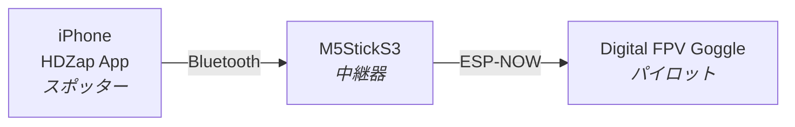
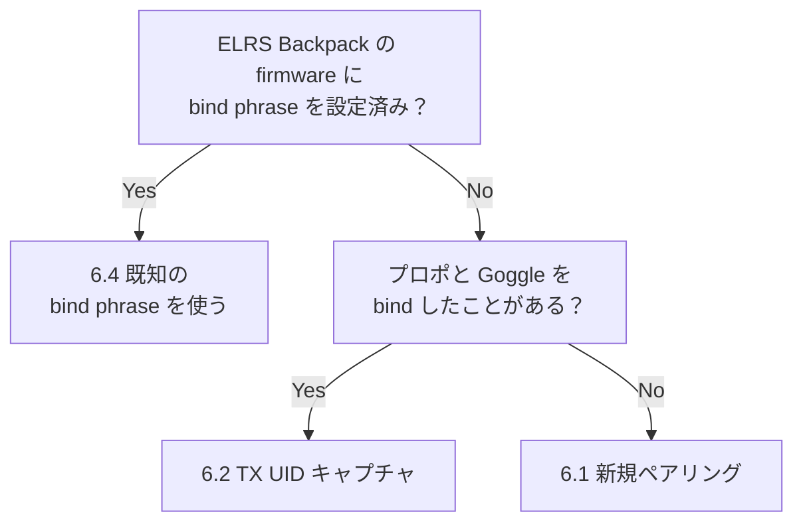

# HDZap ユーザーマニュアル

<p align="center">
  
</p>

<p align="center">
  <a href="https://saqoosha.github.io/HDZap/">English</a> ・ <strong>日本語</strong>
</p>

> **サポート.** 質問・バグ報告・要望は [a@saqoo.sh](mailto:a@saqoo.sh) または [GitHub Issues](https://github.com/Saqoosha/HDZap/issues) までお願いします。よくある問題は下の [§11 トラブルシューティング](#11-うまくいかないときトラブルシューティング) を参照してください。

---

## 目次

1. [これは何？](#1-これは何)
2. [必要なもの](#2-必要なもの)
3. [M5StickS3 にファームウェアを焼く](#3-m5sticks3-にファームウェアを焼く)
4. [iPhone アプリをインストール](#4-iphone-アプリをインストール)
5. [M5StickS3 と iPhone をペアリング（Bluetooth）](#5-m5sticks3-と-iphone-をペアリングbluetooth)
6. [Digital FPV Goggle と bind する](#6-digital-fpv-goggle-と-bind-する)
7. [フライトバッテリーテレメトリー](#7-フライトバッテリーテレメトリー)
8. [レースする](#8-レースする)
9. [レースのあとに](#9-レースのあとに)
10. [設定リファレンス](#10-設定リファレンス)
11. [うまくいかないとき（トラブルシューティング）](#11-うまくいかないときトラブルシューティング)
12. [付録](#12-付録)

---

## 1. これは何？

<p align="center">
  <iframe width="640" height="480"
          src="https://www.youtube.com/embed/FXDKoBYkyB4"
          title="HDZap demo"
          frameborder="0"
          allow="accelerometer; autoplay; clipboard-write; encrypted-media; gyroscope; picture-in-picture"
          allowfullscreen></iframe>
</p>

HDZap は、**iPhone で計測したラップタイムを Digital FPV Goggle の OSD に表示する** ためのシステムです。**パイロットとは別に、計測してくれるスポッターが1人必要** な、二人組での運用を前提としています。



システムは3つの要素でできています。

- **iPhone アプリ**：スポッターが操作するタイマー UI。スタート / LAP / ストップ / 履歴管理。
- **M5StickS3**：手のひらサイズの小型 ESP32 デバイス（中継器）。Bluetooth で iPhone から命令を受け、ESP-NOW という別の電波で Goggle に OSD コマンドを送ります。
- **Digital FPV Goggle**：パイロットが装着する FPV ゴーグル。内蔵の ELRS Backpack を通して OSD（画面オーバーレイ）にラップタイムを表示します。

> 💡 **iPhone アプリだけでも使えます。** タイム計測、ラップ履歴、音声読み上げなどはアプリ単体で完結します。M5StickS3 と Goggle を追加すると、それに加えてラップタイムが Goggle の OSD にも表示されるようになります。

### 用語ミニマップ

このあと頻繁に出てくる用語です。詳しい説明は [付録](#12-付録) にあります。

| 用語 | 1行説明 |
|---|---|
| **Goggle** | パイロットが装着する FPV ゴーグル。Digital FPV Goggle / Digital FPV Goggle 2 |
| **ELRS Backpack** | Goggle 内蔵の ESP32 モジュール。OSD コマンドを受信する |
| **UID** | 6 バイトの識別子。Goggle と M5StickS3 が同じ UID を持つと通信できる |
| **bind phrase** | UID を生成するもとになる文字列。同じ phrase ならどの機材でも同じ UID になる |
| **OSD** | On-Screen Display。映像の上に重ねて表示する文字 |

---

## 2. 必要なもの

### ハードウェア

- **M5StickS3** ×1（中継器）

  

- **USB-C データケーブル** ×1
  - **充電専用ケーブルは使えません**。データ通信ができるケーブルが必要です
- **Digital FPV Goggle**（Digital FPV Goggle / Digital FPV Goggle 2）
- **iPhone**（iOS 18 以降）

### ソフトウェア

- **Google Chrome**
  - Web Flasher は Web Serial API を使うため、**Safari / Firefox では動作しません**。Chromium 系（Edge、Brave など）も Web Serial に対応しているので技術的には動くはずですが、未検証です
- 動作確認環境：**macOS 26.4 + Chrome** のみ

### 必須：Goggle 側のファームウェア v1.5.5 以上

> ⚠️ **Digital FPV Goggle の ELRS Backpack ファームウェアが v1.5.5 以上であることが必須です。**
>
> 古いバージョンだと HDZap が送る OSD コマンドの一部が無視されたり、正しく描画されなかったりすることがあります。

#### バージョンの確認方法

Goggle のメニュー → **ELRS** で確認できます。

#### アップデートの方法

ExpressLRS Configurator を使って ELRS Backpack のファームウェアをアップデートします。HDZap からは Goggle 側のアップデートはできません。

- ExpressLRS Configurator: https://github.com/ExpressLRS/ExpressLRS-Configurator/releases


> 💡 **トラブルの大半はファームウェアの古さが原因です。** Chapter 6 で OSD が出ないときは、まずバージョンを疑ってください。

---

## 3. M5StickS3 にファームウェアを焼く

**Web Flasher** というブラウザだけで完結するツールを使います。

### 手順

1. **Chrome** で次の URL を開きます。
   👉 https://saqoosha.github.io/HDZap/flash/ja/

2. **M5StickS3** を USB-C データケーブルで PC に接続します。

3. ブラウザで **「接続」** をクリック。シリアルポート選択のダイアログが出るので、`USB JTAG/serial debug unit` または `USB Serial` のような名前のポートを選びます。多くの場合、esptool が自動で M5StickS3 をブートローダーモードに入れて書き込みを始めます。

4. **接続できないとき：DFU モードに手動で入れる**
   「ブートローダーに接続中…」のまま止まったり、エラーが出たりする場合は、M5StickS3 の **左側面の小さな電源ボタン** を **2 秒ほど長押し** します。緑色の LED が点滅すれば DFU モードに入っています。この状態でもう一度「接続」をクリック。

5. **「完全初期化する」** チェックボックスについて：
   - **初回フラッシュ時はチェックを推奨**。M5StickS3 のフラッシュメモリを完全に消去してから書き込みます
   - **2回目以降の更新時はチェックを外す**。NVS に保存されている UID（Goggle とのペアリング情報）が保持されます

6. **「書き込む」** をクリック。プログレスバーが進み、完了まで 30 秒〜1 分ほどかかります。

7. **書き込みが終わったら**、M5StickS3 の **左側面の小さな電源ボタンを押して再起動** します。LCD に状態が表示されれば成功です。

   

### うまくいかないとき

- **`ESP_TOO_MUCH_DATA` というエラーが出る**：ブラウザを最新の Chrome に更新してください。
- **ポートが選べない / 表示されない**：ケーブルを変えてみてください（充電専用ではないか確認）。それでも駄目なら DFU モードに手動で入れ直してから（電源ボタン 2 秒長押し）もう一度接続。
- **Allow ダイアログが出ない**：一度ブラウザを閉じて、URL を開き直してください。

---

## 4. iPhone アプリをインストール

> ℹ️ **HDZap はまだベータ版です。** 現在は TestFlight 経由で配布しています。近日中に App Store でも公開予定です。

1. iPhone で次の **TestFlight 招待リンク** を開きます。

   <div class="copy-link">
     <a href="https://testflight.apple.com/join/gjjbKFp3" class="copy-link-url">https://testflight.apple.com/join/gjjbKFp3</a>
     <button class="copy-link-btn" type="button" data-clipboard="https://testflight.apple.com/join/gjjbKFp3" data-copied-label="コピーしました ✓">コピー</button>
   </div>

2. **TestFlight アプリ** が無ければ App Store から先にインストールします。
3. TestFlight 上で HDZap の **「インストール」** ボタンをタップ。
4. ホーム画面に追加された HDZap アイコンをタップして起動。

5. 初回起動時に **Bluetooth の使用許可** を求められるので **「許可」** をタップします。これを拒否すると M5StickS3 と接続できません。

   

---

## 5. M5StickS3 と iPhone をペアリング（Bluetooth）

iPhone と M5StickS3 を Bluetooth で接続します。操作場所は iOS アプリの **設定（⚙️）→ デバイス → M5StickS3**。

### 手順

1. M5StickS3 の電源を入れます（LCD に表示が出ている状態）。
2. iPhone の HDZap アプリを開き、画面右上の **歯車アイコン（⚙️）** をタップして設定シートを開きます。
3. 設定シートの **デバイス** セクションにある **M5StickS3** をタップして接続画面に入ります。
4. **スキャン** ボタンをタップ。近くの M5StickS3 が **その他のデバイス** セクションに表示されます。
5. **HDZapBridge**（または下の[M5StickS3 の名前を変更する（任意）](#m5sticks3-の名前を変更する任意)で変えた任意の名前）の横の **接続** ボタンをタップ。

6. 接続成功すると：
   - **接続済み** セクションに緑の丸とデバイス名 + **切断** ボタンが現れる
   - その下にバッテリ % と充電アイコン、**バージョン**（App + FW）が出る
   - M5StickS3 側の LCD にも接続状態が出る

これで iPhone と M5StickS3 の通信路ができました。次は Goggle との bind です。

### M5StickS3 の名前を変更する（任意）

M5StickS3 を複数台持っている場合、デフォルトの `HDZapBridge` のままだと識別しづらくなります。接続中なら次の手順で名前を変えられます：

1. 設定 → **デバイス** → **M5StickS3**。
2. **Bluetooth 名** をタップ。
3. 新しい名前を入力（UTF-8、最大 20 バイト。絵文字 1 文字 ≒ 4 バイト）して **保存** をタップ。
4. M5StickS3 が一度だけ自動再起動します（約 3 秒）。iPhone は自動で再接続し、新しい名前が M5StickS3 の LCD の UID 帯と iOS 側の接続済みセクションに反映されます。

> 💡 新しい名前はフラッシュメモリに保存されるので、電源を切っても残ります。`HDZapBridge` を入れて保存し直せばデフォルトに戻ります。

### うまくいかないとき

- **デバイス一覧に何も出ない**：iPhone の設定アプリ → HDZap → Bluetooth が ON になっているか確認。M5StickS3 の電源を入れ直してください。
- **接続ボタンを押しても繋がらない**：iPhone の設定 → Bluetooth に HDZap が出ている場合は一度「このデバイスの登録を解除」してから、もう一度試してください。

---

## 6. Digital FPV Goggle と bind する

操作場所は iOS アプリの **設定（⚙️）→ デバイス → ゴーグルペアリング**（サブ画面のタイトルは **ペアリング**）。動作確認は **設定 → デバイス → OSD レイアウト** を開くだけで OK — ページを開いた瞬間にプレビューが Goggle に自動表示されます。

### 前提チェック

> ⚠️ Goggle の ELRS Backpack ファームウェアが **v1.5.5 以上** であることを確認してください。詳細は [Chapter 2](#必須goggle-側のファームウェア-v155-以上) を参照。

### なぜ bind が必要？

M5StickS3 が Goggle に OSD コマンドを送るには、**両者が同じ UID（6 バイトの識別子）を持つ必要** があります。これを揃える作業が「bind」です。

### 判定フローチャート：あなたはどれ？



> 📝 **6.3 手動 UID 入力** という選択肢もありますが、現時点での Goggle 公式ファームウェアにはバグがあり、Goggle メニューから UID を読み取ることが事実上できません。そのため上のフローチャートには含めていません。状況により使える人だけ [6.3](#63-手動-uid-入力上級者向け) を参照してください。

### bind phrase と UID の関係

- **bind phrase**：人間が決める文字列（例：`my-race-2026`）
- **UID**：6 バイトの数値（例：`123, 45, 67, 89, 0, 12`）

bind phrase を MD5 ハッシュにかけた最初の 6 バイトが UID になります。**同じ bind phrase を入れれば、どの機材でも必ず同じ UID** が出ます。

---

### 6.1 新規ペアリング

**こういう人向け**：Goggle が新品。または、まっさらな状態から M5StickS3 と Goggle だけで bind したい。

> ⚠️ **この操作は Goggle の既存の binding を上書きします。** プロポとのペアリング情報は失われます（プロポを使うときは再度 bind が必要）。

#### 手順

1. **Goggle を bind モードに入れる**：
   1. Goggle メニュー → **ELRS** を開く
   2. **Backpack** を **On** にする
   3. **Bind** → **Click to start** を選択
   4. Goggle が「bind 待ち」状態になります
2. アプリの設定シート → **デバイス** → **ゴーグルペアリング** へ。
3. **モード** ピッカーで **新規ペアリング** を選択。
4. **新しいゴーグルとペアリング** ボタンをタップ。M5StickS3 が bind パケットをブロードキャスト。
5. Goggle が受理すると binding 完了。
6. アプリ側の状態バナーが検証を経て完了になれば OK。
7. **動作確認**：設定 → **デバイス** → **OSD レイアウト** を開く。Goggle にプレビューが自動表示されれば成功。

---

### 6.2 TX UID キャプチャ（プロポで bind 済みの Goggle）

**こういう人向け**：プロポと Goggle を bind したことがある。bind phrase は指定したことがない（または控えていない）。プロポが手元にある。

> ✅ この方法は **プロポと Goggle の既存の binding を壊しません**。M5StickS3 がプロポのブロードキャストを受動的に「盗み聞き」して UID を抜き出すだけです。

#### 手順

1. Goggle の電源を入れ、プロポに bind 済みであることを確認します。映像が出るだけでは確認になりません（VTX 側の話）。**EdgeTX の ExpressLRS Lua スクリプトから VTX チャンネルを変更し、それが Goggle に伝わるか** で初めて確認できます。
2. アプリの設定シート → **デバイス** → **ゴーグルペアリング** に入り、**TX UID キャプチャ** セクションまでスクロール。
3. **TX UID キャプチャを開始** ボタンをタップ。M5StickS3 が ESP-NOW のブロードキャストを聞き始めます。
4. **EdgeTX の ExpressLRS Lua Script を開き、その中の Bind メニューを実行** します。
5. M5StickS3 が bind ブロードキャストを受信して UID を抜き出し、**キャプチャした TX UID** セクションに表示されます。
6. **適用** をタップ → 切り替えと検証を経て完了。
7. **動作確認**：設定 → **デバイス** → **OSD レイアウト** を開く。Goggle にプレビューが自動表示されれば成功。

---

### 6.3 手動 UID 入力（上級者向け）

> ⚠️ **注意**：現時点の Goggle 公式リリースファームウェアにはバグがあり、Goggle メニューから UID を読み取ることが事実上できません。**この方法は今のところ普通のユーザーには使えません。** 将来的にゴーグルファームウェアが修正されたら使える方法として記載しています。

**理屈の上での手順**：

1. Goggle の **メニュー → ELRS** を選択すると、`Bind` の行に `UID: xxx,xxx,xxx,xxx,xxx,xxx` という6つの数字が表示されます。
2. アプリの設定シート → **デバイス** → **ゴーグルペアリング** へ。
3. **モード** ピッカーで **手動 UID** を選択。
4. **1 つの入力フィールド** にカンマ区切りで 6 つの数字を入力します。
5. **UID を適用** をタップ → 切り替えと検証を経て完了。
6. **動作確認**：設定 → **デバイス** → **OSD レイアウト** を開く。Goggle にプレビューが自動表示されれば成功。

---

### 6.4 既知の bind phrase を使う

**こういう人向け**：ExpressLRS Configurator で **プロポの Backpack と Goggle の ELRS Backpack の両方** に、同じ bind phrase を焼き込んだファームウェアを書き込んだことがある人。その bind phrase を控えている（または覚えている）。

#### 手順

1. アプリの設定シート → **デバイス** → **ゴーグルペアリング** へ。
2. **モード** ピッカーで **バインドフレーズ** を選択。
3. テキストフィールドに、ELRS Backpack に書き込んだのと同じ bind phrase を入力。
4. **UID を適用** ボタンをタップ。
5. 状態バナーが切り替えと検証を経て完了するのを待ちます 🎉
6. **動作確認**：設定シート → **デバイス** → **OSD レイアウト** を開く。ページを開いた瞬間にプレビューが Goggle に自動表示されれば bind 成功です 🎉

---

### 動作確認

bind が成功したら、**設定 → デバイス → OSD レイアウト** ページを開いて確認します。

開いた瞬間に、現在のレイアウト設定に基づいたプレビュー（4 行のダミー文字）が **自動的に Goggle に送られて表示** されます。これが見えれば、iPhone → M5StickS3 → Goggle の通信路すべてが正常です 🎉

文字が出ないときは [Chapter 6 の判定フロー](#判定フローチャートあなたはどれ) を最初からやり直してください。

> 💡 **テスト OSD を送信** ボタンも同じ画面にあります。タップすると **現在時刻** が Goggle に 1 回送られます（毎回タップする度に更新されるので、パケットが届いているのが目で見て分かります）。プレビューを片付けたいときは横の **OSD をクリア** をタップ。

### 自動ロールバック機能

bind の途中で何か失敗したとき（verify で Goggle から応答が返ってこないなど）、HDZap は **自動的に元の UID に戻します**。「ゴーグルが新しいペアリングを受け入れませんでした。前のペアリングに戻しました。」というバナーが出ます。

また、**ゴーグルペアリング** 画面の **前のゴーグルに戻す** ボタンを使えば、いつでも前の UID に戻せます。

### うまくいかないとき

- **OSD レイアウトを開いても（または テスト OSD を押しても）Goggle に何も出ない**
  1. Goggle ファームウェアが v1.5.5 以上か再確認 → これが最頻原因
  2. Goggle との距離は近いか（数 m 以内推奨）
  3. もう一度 「UID を適用」を押してみる
  4. 別の bind 方法（6.1 / 6.2 / 6.4）を試す
- **`確認中…` のまま進まない**：30 秒待ってもダメなら自動でロールバックします。Goggle の電源確認、ファームウェアバージョン確認をやり直してください。

---

## 7. フライトバッテリーテレメトリー

M5StickS3 がパイロットのプロポから CRSF Battery テレメトリーを受信している間、HDZap は **メイン画面** にリアルタイムでバッテリー情報を表示し、レース後の確認用にデータを記録します。

### ライブ VBAT ストリップ（メイン画面）

セッションバーの上にストリップが表示されます。

- **ステータスドット**：緑 = データ受信中、琥珀色 = 信号が途切れた（電源 OFF・圏外・プロポ側でテレメトリーを無効化）、非表示 = まだデータなし
- **電圧**（V）
- **消費 mAh**
- **残量 %** + プログレスバー（プロポ側が値を「不明」と報告している場合は非表示）

デバイスへの接続後にテレメトリーが1つも届いていない場合、ストリップは完全に非表示になります。

### レース後（履歴詳細画面）

レース後、履歴一覧から詳細を開くと **VBAT** セクションが表示されます。

- **Start / Min / End** 電圧ラベルとサンプル数
- レース時間に対する電圧推移チャート（ラップ境界マーカー付き）

共有ボタンで生成するリザルトカード画像にも、VBAT チャートが自動で含まれます。生データ（電圧・電流・消費 mAh・残量 %）を CSV で書き出すには、詳細画面のツールバー右端にある **バッテリーアイコン** をタップします。

### VBAT データの前提条件

以下の3つがすべて揃っている必要があります。

1. **プロポ側で ELRS Backpack テレメトリーを有効** にしていること：EdgeTX の ExpressLRS Lua スクリプトで **Backpack → Telemetry** を **ESPNOW** に設定する。
2. **プロポと Goggle が bind 済み** であること — プロポの bind ブロードキャストがプロポの識別情報として使われます。
3. **TX UID キャプチャを一度以上実行済み** であること（[6.2 TX UID キャプチャ](#62-tx-uid-キャプチャプロポで-bind-済みの-goggle) で実施）。これによりプロポの送信元 MAC が M5StickS3 のフラッシュに保存されます。一度保存すれば再起動後も有効です。ただし Web Flasher で「完全初期化する」を使って書き直すと消えます。

> ⚠️ [新規ペアリング（6.1）](#61-新規ペアリング) や [バインドフレーズ（6.4）](#64-既知の-bind-phrase-を使う) でペアリングした場合、プロポ送信元フィルターは設定されません。VBAT を有効にするには、ゴーグルペアリングはそのままで TX UID キャプチャを一度実行してください。

---

## 8. レースする

bind ができたら、いよいよ走らせます。

### レース設定

1. アプリ画面右上の歯車アイコン → 設定シートを開く。
2. シート上部の **フォーマット** セクションで **レース時間**（既定 90 秒）と **目標ラップ数** を調整（**目標ペース** は自動計算）。
3. 設定シートを閉じる。

### 走らせる

1. メイン画面の **START ボタン** をタップ。タイマーが動き出します。
2. パイロットがゴール線を越えるたびに **LAP ボタン** をタップ。
3. レース時間（既定 90 秒）に達すると、ボタンの表示が **`FINAL`** に変わります。**最後のラップを `FINAL` ボタンでタップ** することでレースが終了します（自動では終わりません）。
4. レースを途中で打ち切りたい場合は **STOP** ボタン。

### Goggle 側の OSD 表示

レース中、Goggle 画面下部に最大 4 行のオーバーレイが出ます（**設定 → デバイス → OSD レイアウト** で各行を表示／非表示にしたり、配置や縦位置を変えたりできます）。各行はデフォルトで 50 列グリッドの中央寄せ。

**レース開始前（READY）**：

```
                      READY                       
                     RACE 90                      
                  5LAPS @ 18.00                   
                                                  
```

**レース中（ラップ記録時）**：

```
                   TIME LEFT 67                   
                   LAP 3 23.456                   
                AVG 22.123 PACE 5L                
               D-1.234 BANK +0.5/L                
```

**ペースぴったりのとき**（diff が ±0.005 秒以内）は最後の行が `ON TARGET` 表示になります：

```
                 D+0.00 ON TARGET                 
```

**レース後（DONE）**：

```
                       DONE                       
                   3LAPS 247.36                   
               AVG 82.45 BEST 81.78               
                                                  
```

各フィールドの意味：

- **TIME LEFT**：残り時間（秒）
- **LAP N**：直近のラップ番号と時刻（秒）
- **AVG / PACE**：これまでの平均と、現在のペースで何ラップ走れるか
- **D±x BANK / NEED / ON TARGET**：目標ペースとの差。BANK は貯金、NEED は不足、ON TARGET は目標どおり。`/L` は 1 ラップあたりの差

### フライト中のヒント

- **音声読み上げ**：設定で ON にしておくと、ラップ毎にタイムを iPhone が読み上げます。
- **ハプティック**：LAP / START 時に iPhone が振動するので、画面を見なくても押せたか確認できます。
- **ベストラップ更新**：自動的にハイライト表示されます（星マーク + アクセントカラー）。

---

## 9. レースのあとに

### 共有する

タイマー画面の **共有ボタン** をタップすると、レース結果をまとめたリザルトカードが画像として生成され、iOS の標準共有シートが開きます。画像として保存、SNS 投稿、メッセージ送信などができます。

リザルトカードに含まれる情報：

- ラップ数（大きく表示）
- 合計時間
- ペース、平均タイム、ベストラップ
- ラップ表
- **VBAT 電圧チャート**（フライトバッテリーテレメトリーが記録されている場合のみ — [7 章](#7-フライトバッテリーテレメトリー) 参照）

### 履歴を見る

1. メイン画面右上の **時計アイコン** をタップ → 履歴シートが開きます。
2. 過去のレースが新しい順に並びます。各行に **ラップ数・合計タイム・ラップ推移スパークライン・ベストラップ** が表示されます。
3. 行をタップすると詳細画面（リザルトカードと同じ表示）に遷移。

### 削除する

- **個別削除**：履歴一覧で行を左にスワイプ → 削除。
- **全削除**：履歴画面右上のメニュー（…）→ 「全て削除」。確認ダイアログが出ます。

---

## 10. 設定リファレンス

### フォーマット

- **レース時間**：60〜180 秒（5 秒刻み）
- **目標ラップ数**：例 5L
- **目標ペース**：レース時間と目標ラップ数から自動計算（読み取り専用）

### デバイス → M5StickS3（接続）

- 上部にステータスドット + デバイス名
- **接続済み**：デバイス名・識別子の先頭部分・バッテリ %・充電アイコン・**切断** ボタン
- **Bluetooth 名**（接続中だけ表示）：M5StickS3 の名前を変更する画面に入ります。UTF-8 で最大 20 バイト、保存後 1 度だけ自動再起動し、iPhone も自動で繋ぎ直します。詳細は [Chapter 5 → M5StickS3 の名前を変更する（任意）](#m5sticks3-の名前を変更する任意)。
- **その他のデバイス**：周辺の M5StickS3。各行に **接続** ボタン
- **スキャン** ボタン：再スキャン

### デバイス → ゴーグルペアリング

モード切り替えで「バインドフレーズ／手動 UID／新規ペアリング」のフォームを切り替えます。**TX UID キャプチャ** も同じ画面の下にあります。詳しいワークフローは [Chapter 6](#6-digital-fpv-goggle-と-bind-する)。

- **現在の UID**：M5StickS3 にいま入っている UID
- **UID を適用 / 新しいゴーグルとペアリング**：選んだフローを実行。切り替え → 検証 → 完了 / 自動ロールバックと進みます
- **前のゴーグルに戻す**：適用に失敗した直後に手動で巻き戻すボタン

### デバイス → OSD レイアウト

ゴーグルの OSD のライブエディタ。画面上部に 4 行プレビューがあり、変更はリアルタイムでゴーグルにプッシュされるので、レースを走らせなくても見た目を確認できます。

- **上端の行** スライダー：18 行のゴーグル画面のどこに OSD ブロックを置くか（1 = 最上、デフォルト = 下端揃え）
- **配置**：左 / 中央 / 右。すべての可視行に適用
- **表示する行**：**残り時間 / ラップ / ペース / ペース差** を個別に表示／非表示。隠した行は詰めて表示されるのでブロックは常にコンパクトに保たれます
- **テスト OSD を送信**：iPhone の現在日時をゴーグルに 1 回だけ送る。タップごとに時刻が更新されるのでパケットが届いているか目視で確認できます
- **OSD をクリア**：ゴーグルのオーバーレイバッファを消す
- **レイアウトをリセット**：エディタを既定値（下端揃え・中央配置・全行表示）に戻す

### アプリ → ラップ読み上げ

- **ラップタイムを読み上げる**：ON / OFF
- **ベスト更新時に「ベストラップ」と読み上げる**：新ベスト時に読み上げに「ベストラップ」を付ける
- **言語**：日本語、英語など
- **音声**：システム標準 + インストール済みの追加ボイス
- **速度**：読み上げ速度
- **ピッチ**：声の高さ
- **音声テスト**：現在の設定で読み上げを試す
- **リセット**：ラップ読み上げの設定を初期化

### アプリ → 外観

- **ハイライト色** スライダー：UI のテーマ色を 0〜360° で変更

### 情報

- **アプリのバージョン**：HDZap アプリのバージョン。常に表示。
- **ファームウェア**：M5StickS3 の現行ファームウェアバージョン。接続後に表示されます。アプリと大きく食い違っている場合は **赤字** で警告が出るので、その場合は Web Flasher で M5StickS3 を再書き込みしてください。同じ情報は **設定 → デバイス → M5StickS3** の **バージョン** 行でも見られます。

---

## 11. うまくいかないとき（トラブルシューティング）

### M5StickS3 関連

| 症状 | 対処 |
|---|---|
| LCD に何も出ない / 起動しない | Web Flasher で「完全初期化する」をチェックして再フラッシュ |
| Web Flasher で `ESP_TOO_MUCH_DATA` | Chrome を最新版に更新 |
| ポートが選べない | DFU モード入り直し（電源ボタン 2 秒長押し）、ケーブル交換（充電専用でないか確認） |
| Allow ダイアログが出ない | ブラウザを閉じて URL を開き直す |
| すべてリセットしたい | Web Flasher で「完全初期化する」にチェックして再フラッシュ |

### Bluetooth 関連

| 症状 | 対処 |
|---|---|
| デバイス一覧に M5StickS3 が出ない | iPhone 設定で HDZap の Bluetooth 許可を確認、M5StickS3 再起動 |
| 接続が切れる | iPhone と M5StickS3 の距離を縮める、iPhone の Bluetooth リストから一度 forget して再接続 |

### Goggle / OSD 関連

| 症状 | 対処 |
|---|---|
| Goggle に OSD が出ない | **まず Goggle Backpack のファームウェアが v1.5.5 以上か確認**（最頻原因）。次に [Chapter 6 の判定フロー](#判定フローチャートあなたはどれ) を最初からやり直す |
| OSD の文字が崩れる / 一部しか出ない | Goggle ファームウェアバージョンを再確認。次に周囲の 2.4 GHz 電波干渉（Wi-Fi、ドローン本体など）を疑う |
| bind 直後に OSD が出ない | アプリの「前のゴーグルに戻す」で前の状態に戻し、別の bind 方法を試す |

---

## 12. 付録

### 用語集

- **bind phrase**：UID を生成するもとになる人間可読な文字列。MD5 ハッシュの先頭 6 バイトが UID になる。
- **UID**：6 バイトの識別子。M5StickS3 と Goggle が同じ UID を持つと通信できる。先頭バイトのビット 0 は常に 0（マルチキャスト MAC を避ける制約）。
- **MSP / MSPv2**：MultiWii Serial Protocol。FPV 機材間でよく使われる軽量なバイナリ通信プロトコル。HDZap はこの v2 で OSD コマンドを送る。
- **OSD**：On-Screen Display。映像の上に重ねて表示される文字オーバーレイ。
- **ELRS（ExpressLRS）**：オープンソースのラジオコントロールリンク。受信機 / 送信機 / Backpack を含むエコシステム。
- **Backpack**：Goggle やプロポに付ける ESP32 モジュール（Digital FPV Goggle では内蔵）。映像信号とは別の制御チャネル。
- **ESP-NOW**：ESP32 がペアリング不要で使える独自のピアツーピア無線通信。Wi-Fi の物理層を流用。
- **BLE / GATT**：Bluetooth Low Energy / Generic Attribute Profile。iPhone と M5StickS3 間の通信に使う。

### 互換ハードウェア

公式にサポートしているのは **M5StickS3** のみです。他の ESP32 ボードへの対応はリクエスト次第で検討します。参考情報は [互換ボード一覧](https://github.com/saqoosha/HDZap/blob/main/docs/compatible-devices.md) にあります。

### 開発者向け技術詳細

- [README](https://github.com/saqoosha/HDZap)（リポジトリ全体の開発者向け説明）
- [docs/report.md](https://github.com/saqoosha/HDZap/blob/main/docs/report.md)（MSPv2 / ESP-NOW / ELRS bind プロトコル調査）
- [docs/architecture.md](https://github.com/saqoosha/HDZap/blob/main/docs/architecture.md)（システム構成）

### ライセンス・コントリビューション

- ソースコード：[GitHub リポジトリ](https://github.com/saqoosha/HDZap)
- バグ報告・機能要望：[Issues](https://github.com/saqoosha/HDZap/issues)

---

<p align="center">
  <em>Happy racing!</em> 🏁
</p>
